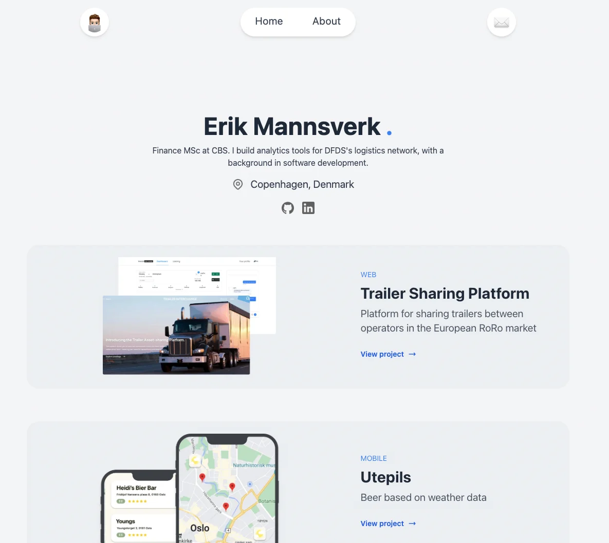

# erikmannsverk.com

My personal portfolio: projects in logistics analytics, web and mobile development.

**Live:** [www.erikmannsverk.com](https://www.erikmannsverk.com)



## About me
MSc Finance & Investments student at Copenhagen Business School, working part-time as a
Junior Business Analyst at DFDS, where I build analyses and tools for the logistics network.
Background in software development (BSc Informatics, University of Oslo).

[LinkedIn](https://www.linkedin.com/in/erik-mannsverk/) · [Email](mailto:mannsverkerik@gmail.com)

## Built with
React · TypeScript · Vite · Tailwind CSS · React Router

## Run locally
```bash
git clone https://github.com/erikmannsverk/portfolio.git
cd portfolio
npm install
npm run dev
```

## Structure
```
src/
├── components/   # Navbar, Hero, About, project cards, footer
├── pages/        # Home, contact and one page per project
└── data/         # projectData.json – project list shown on the home page
```
Adding a project = one entry in `projectData.json` + a detail page in `pages/`.